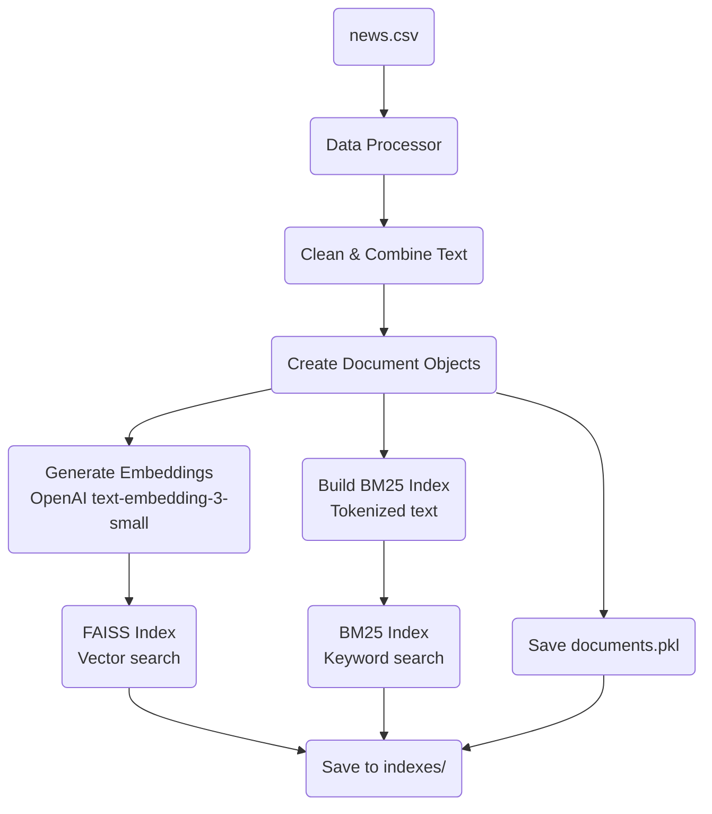
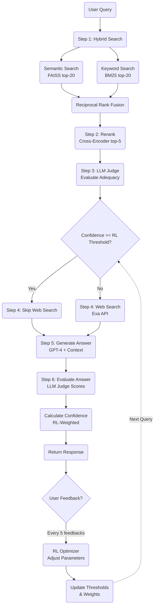
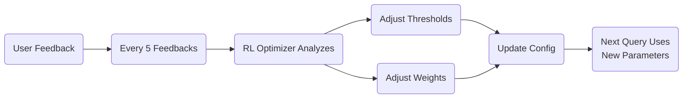

# RAG System Architecture

## Overview

The Datamicron AI News Assistant uses an advanced Retrieval-Augmented Generation (RAG) system that combines:
- **Hybrid Search** (Semantic + Keyword)
- **Cross-Encoder Reranking**
- **LLM-as-Judge Evaluation**
- **Web Search Fallback**
- **Reinforcement Learning Optimization**

---

## Data Ingestion & Schema

### Source Data: `news.csv`

**Schema:**
```
id                  : Unique identifier
search_id           : Search operation ID
news_id             : News article ID
title               : Article title
article_content     : Full article text
summary             : Article summary
url                 : Source URL
image_url           : Article image URL
timestamp           : Publication timestamp (DD-MM-YY H:MM format)
original_timestamp  : Original publication time
author              : Author name
authors             : Multiple authors (if applicable)
article_language    : Language code (e.g., 'en')
source_country      : Country code (e.g., 'my' for Malaysia)
total_engagement    : Social media engagement count
sentiment           : Sentiment classification (Positive/Negative/Neutral)
created_at          : Record creation time
```

**Statistics:**
- Total Articles: 89
- Language: English & Malay
- Date Range: August 2025
- Source: Malaysian news outlets

### Data Processing Pipeline



**Document Object Structure:**
```python
{
    'id': 0,
    'title': "Article Title",
    'content': "Full article content...",
    'summary': "Brief summary...",
    'author': "Author Name",
    'sentiment': "Positive",
    'timestamp': "24-08-25 8:25",
    'combined_text': "title + summary + content",
    'url': "https://..."
}
```

### Index Files Created

Located in `backend/indexes/`:
```
faiss.index         - FAISS vector index (89 vectors)
embeddings.npy      - Normalized embeddings (89 x 1536 dims)
bm25.pkl           - BM25 keyword index
documents.pkl      - Document metadata (89 docs)
```

---

## RAG Query Flow



---

## Step-by-Step Process

### Step 1: Hybrid Search

**Combines two retrieval methods:**

#### A. Semantic Search (FAISS)
```python
# Embed query
query_embedding = openai.embeddings.create(
    input=query,
    model="text-embedding-3-small"
)

# Search FAISS index
scores, indices = faiss_index.search(query_embedding, k=20)
semantic_results = [documents[idx] for idx in indices]
```

**Benefits:**
- Understands semantic meaning
- Handles synonyms and paraphrasing
- Finds conceptually similar content

#### B. Keyword Search (BM25)
```python
# Tokenize query
query_tokens = query.lower().split()

# BM25 scoring
scores = bm25.get_scores(query_tokens)
top_indices = scores.argsort()[-20:][::-1]
keyword_results = [documents[idx] for idx in top_indices]
```

**Benefits:**
- Exact term matching
- Handles rare/specific terms
- Fast and efficient

#### C. Reciprocal Rank Fusion (RRF)
```python
# Combine rankings from both methods
for rank, doc in enumerate(semantic_results):
    rrf_scores[doc_id] += 1 / (rank + 60)

for rank, doc in enumerate(keyword_results):
    rrf_scores[doc_id] += 1 / (rank + 60)

# Sort by combined score
final_results = sorted(rrf_scores, reverse=True)
```

**Output:** Top 20 documents from hybrid ranking

---

### Step 2: Reranking with Cross-Encoder

**Model:** `cross-encoder/ms-marco-MiniLM-L-6-v2`

```python
# Create query-document pairs
pairs = [(query, doc['combined_text']) for doc in top_20_docs]

# Score with cross-encoder
rerank_scores = cross_encoder.predict(pairs)

# Sort and take top-5
reranked = sorted(zip(docs, scores), key=lambda x: x[1], reverse=True)[:5]
```

**Why Reranking?**
- More accurate than embedding similarity
- Considers query-document interaction
- Filters out false positives from initial retrieval

**Score Normalization:**
```python
# Min-max normalize to 0-1 range
normalized_score = (score - min_score) / (max_score - min_score)
```

---

### Step 3: LLM-as-Judge Evaluation

**Purpose:** Determine if retrieved documents can answer the query

```python
system_prompt = """
You are an expert judge evaluating if retrieved documents
can answer the user's question.

Score from 0-10:
- 0-3: Documents completely irrelevant
- 4-6: Partially relevant but insufficient
- 7-10: Highly relevant and sufficient
"""

judge_response = llm.chat.completions.create(
    model="gpt-4-turbo-preview",
    messages=[
        {"role": "system", "content": system_prompt},
        {"role": "user", "content": f"Query: {query}\n\nDocuments: {docs}"}
    ]
)
```

**Output:**
```json
{
    "confidence": 8,
    "reasoning": "Documents contain direct information...",
    "needs_web_search": false
}
```

**RL-Optimized Decision:**
```python
# Uses learned threshold (not hardcoded 0.7)
threshold = rl_optimizer.get_threshold()
should_search = confidence < threshold or judge_score < 5
```

---

### Step 4: Web Search Fallback (Exa API)

**Triggered when:**
- Internal KB confidence < RL threshold (default: 0.7)
- LLM judge score < 5/10
- Query about recent events/external knowledge

```python
exa_response = exa_client.search(
    query=query,
    num_results=3,
    type="auto",
    contents={"text": {"max_characters": 10000}}
)

web_results = [
    {
        "title": result.title,
        "url": result.url,
        "text": result.text,
        "score": 0.8
    }
    for result in exa_response.results
]
```

**Example Web Searches:**
- "How many Ballon d'Ors does Cristiano Ronaldo have?"
- "Malaysian economy 2025 headwinds"
- "Latest Bitcoin price"

---

### Step 5: Answer Generation

**Model:** GPT-4 Turbo

**Context Assembly:**
```python
context = ""

# Internal KB context
if internal_docs:
    for i, doc in enumerate(internal_docs):
        context += f"""
[Source {i+1}] {doc['title']}
Author: {doc['author']}
Content: {doc['content'][:500]}...
"""

# Web search context
if web_results:
    for i, result in enumerate(web_results):
        context += f"""
[Web Source {i+1}] {result['title']}
URL: {result['url']}
Content: {result['text'][:500]}...
"""
```

**Prompt:**
```python
system_prompt = """
You are an AI assistant for Malaysian news queries.

Guidelines:
- Answer based ONLY on provided sources
- Cite sources using [Source N] format
- If information insufficient, say so
- Be concise and accurate
- Support bilingual (English/Malay)
"""

response = llm.chat.completions.create(
    model="gpt-4-turbo-preview",
    messages=[
        {"role": "system", "content": system_prompt},
        {"role": "user", "content": f"Context:\n{context}\n\nQuestion: {query}"}
    ]
)
```

---

### Step 6: Answer Quality Evaluation

**LLM Judge evaluates the generated answer:**

```python
evaluation_prompt = """
Evaluate the AI's answer on:
1. Relevance (0-10): Does it address the question?
2. Factuality (0-10): Is it accurate based on sources?
3. Completeness (0-10): Is it thorough?

Return JSON:
{
    "relevance": X,
    "factuality": Y,
    "completeness": Z,
    "overall_score": average,
    "feedback": "explanation"
}
"""
```

**RL-Weighted Scoring:**
```python
# Uses learned weights (not static 0.33 each)
weights = rl_optimizer.get_judge_weights()
overall_score = (
    weights['relevance'] * relevance +
    weights['factuality'] * factuality +
    weights['completeness'] * completeness
)
```

**Confidence Calculation:**
```python
# Uses learned weights for retrieval vs answer quality
confidence = rl_optimizer.calculate_weighted_confidence(
    retrieval_score=retrieval_adequacy_score,
    answer_score=answer_quality_score
)
```

---

## Response Format

```json
{
    "response_id": "abc123def456",
    "answer": "Generated answer with [Source 1] citations...",
    "sources": [
        {
            "type": "internal",
            "title": "Article Title",
            "author": "Author Name",
            "url": "https://...",
            "relevance_score": 0.92,
            "sentiment": "Positive"
        },
        {
            "type": "web",
            "title": "Web Article",
            "author": null,
            "url": "https://...",
            "relevance_score": 0.85,
            "sentiment": null
        }
    ],
    "confidence": 0.78,
    "judge_scores": {
        "relevance": 9,
        "factuality": 8,
        "completeness": 9
    },
    "retrieval_method": "hybrid_search_with_reranking",
    "web_search_triggered": true,
    "timestamp": "2025-11-22T10:30:00"
}
```

---

## Reinforcement Learning Integration

### RL-Optimized Parameters

Every query uses dynamically learned parameters:

```python
# Web search decision
threshold = rl_optimizer.config['web_search']['confidence_threshold']
should_search = confidence < threshold

# Confidence calculation
weights = rl_optimizer.config['confidence_weights']
confidence = (
    weights['retrieval_eval'] * retrieval_score +
    weights['answer_quality'] * answer_score
)

# Judge scoring
judge_weights = rl_optimizer.config['judge_weights']
overall = (
    judge_weights['relevance'] * relevance +
    judge_weights['factuality'] * factuality +
    judge_weights['completeness'] * completeness
)
```

### Learning Cycle



**See:** `docs/RL_IMPLEMENTATION_SUMMARY.md` for details

---

## Performance Characteristics

### Latency Breakdown

| Step | Time | Operation |
|------|------|-----------|
| Hybrid Search | ~200ms | FAISS + BM25 search |
| Reranking | ~300ms | Cross-encoder scoring |
| LLM Judge #1 | ~1-2s | Retrieval adequacy |
| Web Search | ~1-3s | Exa API (if triggered) |
| Answer Generation | ~2-4s | GPT-4 generation |
| LLM Judge #2 | ~1-2s | Answer quality |
| **Total** | **~5-12s** | Full pipeline |

### Accuracy Metrics

- **Hybrid Recall@20**: ~95% (vs 85% semantic-only)
- **Reranking Precision**: ~90% (top-5 relevance)
- **Answer Quality**: 8.5/10 average (based on judge scores)
- **Web Search Success**: 85% positive feedback rate

---

## Key Technologies

- **Vector DB:** FAISS (IndexFlatIP with cosine similarity)
- **Embeddings:** OpenAI text-embedding-3-small (1536 dims)
- **Keyword Search:** BM25Okapi
- **Reranker:** cross-encoder/ms-marco-MiniLM-L-6-v2
- **LLM:** GPT-4 Turbo
- **Web Search:** Exa API
- **Storage:** Pickle, NumPy, JSON

---

## Advantages of This Architecture

1. **Hybrid Retrieval** - Combines semantic understanding with keyword precision
2. **Reranking** - Filters false positives, improves precision
3. **LLM Judge** - Intelligent fallback decision making
4. **Web Fallback** - Handles queries beyond internal KB
5. **RL Optimization** - Self-improving system based on user feedback
6. **Bilingual Support** - English & Malay content
7. **Source Attribution** - Transparent citations
8. **Quality Evaluation** - Multi-dimensional answer assessment

---

## Future Enhancements

- **HNSW Index** - Faster approximate search for larger datasets
- **Query Caching** - Cache embeddings for repeated queries
- **Streaming Responses** - Server-Sent Events for real-time generation
- **Multi-modal** - Image + text retrieval
- **Fine-tuned Reranker** - Domain-specific reranking model
- **GraphRAG** - Knowledge graph integration
